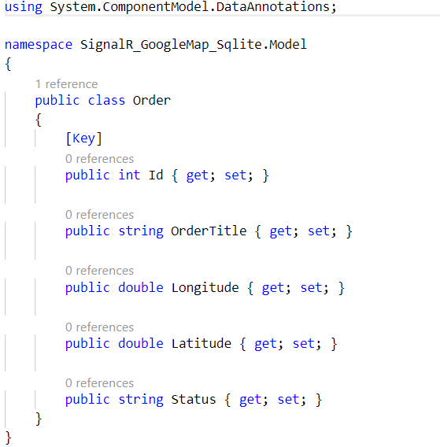

## Setting up Sqlite
I am using Sqlite to store Order details of notification service so to setup our Sqlite application we need to add few packages.

First move the terminal to the Sqlite class library.
```
$ cd SignalR_GoogleMap_Sqlite
```
Now will add three packages.
```
$ dotnet add package Microsoft.EntityFrameworkCore -v 2.1.1
$ dotnet add package Microsoft.EntityFrameworkCore.Design -v 2.1.1
$ dotnet add package Microsoft.EntityFrameworkCore.Sqlite -v 2.1.1
```
These dependencies will help us to add DbContext of Sqlite. So lets create one for us. We will also create a provider which will provide **CRUD**(Create, Read, Update and Delete) operations from DbContext.

First we will create few files in our class library that will hold the context and the provider data.


This will look like this.

## Create Order Model

We are using few properties that are necessary for crating our application you can change it later according to your need.



## SqliteContext
We will create this context file to handle database and will inject this context at the time of Startup. To do this first create the SqliteContext file.


Now you can use this class for connecting to database and perform CRUD Operations by the help of our `SqliteProvider`

## Add Project reference to web project

To use dependency injection for managing the dependencies we need to add project reference to the web application.

```
$ cd SignalR_GoogleMap_Web
$ dotnet add reference ..\SignalR_GoogleMap_Sqlite\SignalR_GoogleMap_Sqlite.csproj
```

This will add the reference of our Sqlite Class Library, now next step is to add packages to the web project.

```
$ dotnet add package Microsoft.EntityFrameworkCore -v 2.1.1
$ dotnet add package Microsoft.EntityFrameworkCore.Design -v 2.1.1
$ dotnet add package Microsoft.EntityFrameworkCore.Sqlite -v 2.1.1
```
We need to add dependency in the startup project to use Sqlite, ***Startup.cs*** file.

```
*Filepath: SignalR_GoogleMap_Web/Startup.cs*
---
services.AddEntityFrameworkSqlite().AddDbContext<SqliteContext>((serviceProvider, options) =>
           options.UseSqlite("Data Source=Orders.db",b=>b.MigrationsAssembly("SignalR_GoogleMap_RealTimeNotification"))
                  .UseInternalServiceProvider(serviceProvider));
---
```
Now you are all set to initialize you database. Run these commands.
```
$ dotnet ef migrations add InitialCreate
$ dotnet ef database update
```
This will create ***Migrations Folder*** and ***Order.db*** file in your web project. Which will look like this.


We are all set now we will build our solution and run the Web Application.
```
$ cd..
$ dotnet build
$ dotnet run -p .\SignalR_GoogleMap_Web\SignalR_GoogleMap_RealTimeNotification.csproj
```

## SqliteProvider
This class will expose methods to perform CRUD(Create Read Update Delete) operations for Orders in the Order Database.

**Note: If you are not using Sqlite you can change the context from Startup file in Web project.**

Lets have a look to the methods that we have created.

```
namespace SignalR_GoogleMap_Sqlite.Repository
{
    public class SqliteProvider
    {
        private readonly SqliteContext _context;
        public SqliteProvider(SqliteContext context)
        {
            _context = context;
        }

        // Fetch All the Records
        public List<Order> GetAll(){
            var query = _context.Orders.ToList();
            return query;
        }

        // Insert Record
        public Order Insert(Order entity){
            _context.Orders.Add(entity);
            _context.SaveChanges();
            return entity;
        }

        // Update Record
        public Order Update(Order entity){
            var exits=_context.Orders.Find(entity.Id);
            if (exits != null)
            {
            _context.Entry(exits).CurrentValues.SetValues(entity);
            _context.SaveChanges();
            }
            return entity;
        }

        // Remove Record
        public Order Remove(Order entity){
            _context.Orders.Remove(entity);
            _context.SaveChanges();
            return entity;
        }

    }
}
```

In the above code I have injected `SqliteContext` in constructor and use it's `Order DbSet` to perform CRUD Operations on Order table.

| Code Snippet        | Operation  |
| -------------       | -----:|
| `_context.Orders.ToList()`          | Read all orders |
| `_context.Orders.Add(entity)`          |   Insert Order in Order table |
| `_context.Entry(exits).CurrentValues.SetValues(entity)`     |    Check for the existing entry and set the new value to it. |
| `_context.Orders.Remove(entity)` | Remove Exiting entry |
| `_context.SaveChanges()` | Update all changes to the Order Table |

So now we are done with CRUD Functionality on Sqlite lets test our application.

| [Previous Topic][1] | [Next Topic][2] |
| :----- | ----: |

[1]: https://github.com/abhinav2127/SignalR_GoogleMap_RealTimeNotification/blob/master/README.md
[2]: https://github.com/abhinav2127/SignalR_GoogleMap_RealTimeNotification/blob/master/Docs/SQLITESETUP.md