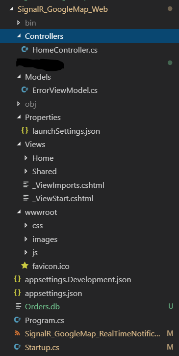

# Create your projects

Create new solution file to manage projects, using:

```
$ dotnet new sln
```

This will create new solution file for you.

Now we need to create our applications, for this project we need three applications WEB, SQLITE, and Test.

Create Directories

```
$ mkdir SignalR_GoogleMap_Web
$ mkdir SignalR_GoogleMap_Sqlite
$ mkdir SignalR_GoogleMap_Tests
```
This will create new directories for holding your projects, which will look like this.

```
|- SignalR_GoogleMap_RealTimeNotification
    |- SignalR_GoogleMap_Web
    |- SignalR_GoogleMap_Sqlite
    |- SignalR_GoogleMap_Tests
- LICENSE
- .gitignore
- README.md
- SignalR_GoogleMap_RealTimeNotification.sln
```

## Sqlite project

This is a class library that will handle all the Database related context, to setup your class library use:

```
$ cd SignalR_GoogleMap_Sqlite
$ dotnet new classlib
```
This will create a class library for you that will look like this.
```
|- SignalR_GoogleMap_Sqlite
    |- bin
- Class1.cs
- SignalR_GoogleMap_Sqlite.csproj
```
Now before we move forward happily we need to build our class library.
```
$ dotnet build
$ cd..
```
## Test Project
This project will contain all the test methods that we will write in future for testing our application based on Unit and Integration tests, to setup your test project use:

```
$ cd SignalR_GoogleMap_Tests
$ dotnet new xunit
```
This will create a test project based on xunit framework that will be used in future for writing tests, your directory will look like this.
```
|- SignalR_GoogleMap_Tests
    |- bin
    |- obj
- UnitTest1.cs
- SignalR_GoogleMap_Tests.csproj
```
Now after we have successfully created our test project we need to build and run test to verify our test project, to do so use:
```
$ dotnet build
$ dotnet test
$ cd..
```
This will build and run the test for you, isn't it ***AMAZING!!!***

## Web Project
At last we need to create our web profile for the project to create our web profile we will create a MVC(Model View Controller) project for storing all the nasty logic of SignalR and for managing the Orders. To create our web project use:
```
$ cd SignalR_GoogleMap_Web
$ dotnet new mvc
```
This will create new MVC project for you, it looks like this.



Now we will build the application.
```
$ dotnet build
```
Now after all this thing we will add the projects to the solution so that we will build and manage project dependency.

## Adding projects to Solutions

To Add project you need to be in parent directory and by using these commands you can add your projects to the solution.

```
$ dotnet sln add SignalR_GoogleMap_Tests/SignalR_GoogleMap_Tests.csproj
$ dotnet sln add SignalR_GoogleMap_Sqlite/SignalR_GoogleMap_Sqlite.csproj
$ dotnet sln add SignalR_GoogleMap_Web/SignalR_GoogleMap_Web.csproj
```
Now we need to build the solution to find every thing is working fine. To do this run:
```
$ dotnet build
Microsoft (R) Build Engine version 15.9.20+g88f5fadfbe for .NET Core
Copyright (C) Microsoft Corporation. All rights reserved.

  Restore completed in 117.48 ms for D:\Projects\Github\.Net Projects\SignalR_GoogleMap_RealTimeNotification\SignalR_GoogleMap_Sqlite\SignalR_GoogleMap_Sqlite.csproj.
  Restore completed in 119.66 ms for D:\Projects\Github\.Net Projects\SignalR_GoogleMap_RealTimeNotification\SignalR_GoogleMap_Tests\SignalR_GoogleMap_Tests.csproj.
  Restore completed in 169.47 ms for D:\Projects\Github\.Net Projects\SignalR_GoogleMap_RealTimeNotification\SignalR_GoogleMap_Web\SignalR_GoogleMap_Web.csproj.
  SignalR_GoogleMap_Tests -> D:\Projects\Github\.Net Projects\SignalR_GoogleMap_RealTimeNotification\SignalR_GoogleMap_Tests\bin\Debug\netcoreapp2.1\SignalR_GoogleMap_Tests.dll
  SignalR_GoogleMap_Sqlite -> D:\Projects\Github\.Net Projects\SignalR_GoogleMap_RealTimeNotification\SignalR_GoogleMap_Sqlite\bin\Debug\netstandard2.0\SignalR_GoogleMap_Sqlite.dll
  SignalR_GoogleMap_RealTimeNotification -> D:\Projects\Github\.Net Projects\SignalR_GoogleMap_RealTimeNotification\SignalR_GoogleMap_Web\bin\Debug\netcoreapp2.1\SignalR_GoogleMap_Web.dll
  SignalR_GoogleMap_RealTimeNotification -> D:\Projects\Github\.Net Projects\SignalR_GoogleMap_RealTimeNotification\SignalR_GoogleMap_Web\bin\Debug\netcoreapp2.1\SignalR_GoogleMap_Web.Views.dll

Build succeeded.
    0 Warning(s)
    0 Error(s)

Time Elapsed 00:00:02.15
```

To run this website we will use:

```
$ dotnet run -p .\SignalR_GoogleMap_Web\SignalR_GoogleMap_Web.csproj

Using launch settings from .\SignalR_GoogleMap_Web\Properties\launchSettings.json...
info: Microsoft.AspNetCore.DataProtection.KeyManagement.XmlKeyManager[0]
      User profile is available. Using '~\AppData\Local\ASP.NET\DataProtection-Keys' as key repository and Windows DPAPI to encrypt keys at rest.
Hosting environment: Development
Content root path: D:\Projects\Github\.Net Projects\SignalR_GoogleMap_Web\SignalR_GoogleMap_Web
Now listening on: https://localhost:5001
Now listening on: http://localhost:5000
Application started. Press Ctrl+C to shut down.
```
This will run the project

[Previous Topic][1] <br>                                     [Next Topic][2]

[1]: ../README.md
[2]: SQLITESETUP.md