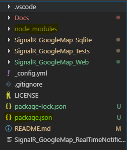
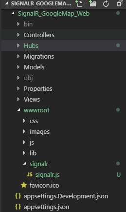

# Setting Up SignalR
SignalR is a software library for Microsoft ASP.NET that allows server code to send asynchronous notifications to client-side web applications. The library includes server-side and client-side JavaScript components.

SignalR provides two models for communication:

`Persistent Connections`: 
The Persistent Connection API gives developer direct access to the low level communication protocol that SignalR exposes. This API uses the format of the actual message sent that needs to be specified and if the developer prefers to work with messaging and dispatching model rather than a remote invocation.

`Hubs`: 
It's a High Level API written over Persistent Connection. This API allows the client and server to call methods on each other directly. Hubs also allow you to pass strongly typed parameters to methods, enabling model binding.

For deep learning I would suggest you to read [SignalR Documentation](https://docs.microsoft.com/en-us/aspnet/signalr/overview/getting-started/introduction-to-signalr)

## Adding SignalR
The SignalR server library is included in the Microsoft.AspNetCore.App metapackage. The JavaScript client library isn't automatically included in the project. For this tutorial, you use NPM to get the client library from node module.

To do this follow these steps:

- Create NPM project and install `@aspnet/signalr` package.
  ```
  $ npm init
  ```
  Accept all the options as we will not use it further. Now you will see the package file generated in the the main directory `MapNotificationModule`.
  
  Now install the `@aspnet/signalr` node package.
  ```
  $ npm install @aspnet/signalr
  ```
  It will take a while to install based on your internet connection.

  Now you can find `node_modules` folder containing all the packages for the project.

  

- Add `signalr.js` to the Web project you will find this file inside your node module.
  ```
  Source File Path
  $ ~\node_modules\@aspnet\signalr\dist\browser\signalr.js
  Destination File Path
  $ ~\SignalR_GoogleMap_Web\wwwroot\signalr\signalr.js
  ```
  Copy `signalr.js` file from the source file path and paste it to the destination file path.

- That's it you are done with NPM now, you can remove the `nodemodule` folder, `package.json` and `package-lock.json` file from your source folder.
  
  This is how web project looks after this process.
  
  

## Create a SignalR hub
A hub is a class that serves as a high-level pipeline that handles client-server communication.

In the `SignalR_GoogleMap_Web` project folder, create a Hubs folder.
  ``` c#
  using Microsoft.AspNetCore.SignalR;
  using System.Threading.Tasks;
  using SignalR_GoogleMap_Sqlite.Model;
  using SignalR_GoogleMap_Sqlite.Repository;
  using System.Collections.Generic;
  
  namespace SignalR_GoogleMap_Web
  {
    public class OrderFeedHub : Hub
    {
        private readonly ISqliteProvider _provider;
        public OrderFeedHub(ISqliteProvider provider)
        {
            _provider=provider;
        }
        public async Task<List<Order>> SendOrderDetail()
        {
            return _provider.GetAll();
        }
    }
  }
  ```
  The `OrderFeedHub` class inherits from the SignalR Hub class. The Hub class manages connections, groups, and messaging.

  The `SendOrderDetail` method can be called by a connected client to send a latest orders to all clients. JavaScript client code that calls the method is shown later in the tutorial. SignalR code is asynchronous to provide maximum scalability.

## Configure SignalR
The SignalR server must be configured to pass SignalR requests to SignalR.
``` c#
---
using SignalR_GoogleMap_Web.Hubs;

namespace SignalR_GoogleMap_Web
{
    public class Startup
    {
        // This method gets called by the runtime. Use this method to add services to the container.
        public void ConfigureServices(IServiceCollection services)
        {
            ----
            // Configuring SignalR
            services.AddSignalR();
            ----
        }

        // This method gets called by the runtime. Use this method to configure the HTTP request pipeline.
        public void Configure(IApplicationBuilder app, IHostingEnvironment env)
        {
            ----
            // Setup route for the orderFeedHub
            app.UseSignalR(routes =>
            {
                routes.MapHub<OrderFeedHub>("/orderFeedHub");
            });
            ----
        }
    }
}
```
Copy these lines as shown above.

Now we are done with SignalR Server our server is ready to be used. So in the `Next Chapter` we will implement Google Map Api with static locations.

[Previous Topic][1] <br>                                [Next Topic][2]

[1]: UnitTestingSqlite.md
[2]: SettingUpGoogleMap.md
